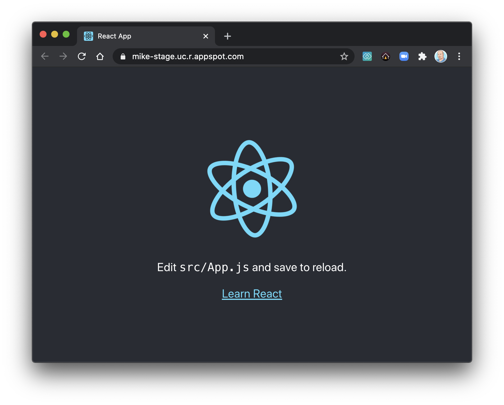

# Deploy a React app to Google App Engine in 5 minutes
Sometimes finding a working example for what is supposed to be a simple task is a challenge. This 
repo contains a current (July 2020) example of how to configure the `app.yaml` to deploy a 
`create-react-app` default build to Google's App Engine standard.

# Prerequisites
 * NodeJS
 * Google Cloud SDK (`gcloud` CLI)
 * Active Google Cloud Platform (GCP) project

# Example


# Usage

1. Download the `setup.sh`, `teardown.sh`, and `app.yaml` files to your computer

2. Create a `.env` (dotenv) file:
```bash
cat > .env << EOF
export APP_NAME="app-engine-react-demo"
export PROJECT_ID="<YOUR GCP PROJECT ID>"
EOF
```

3. Run the setup script
```bash
./setup.sh
```

4. Wait several minutes and then view the app in your browser

# App Engine Config
The tricky part is getting the app config working. There are some examples for App Engine (flex) and differing approaches for flex and standard, but this is a concise working example that will deploy the artifacts from the `/build` folder after running `npm build`.

```yaml
# app.yaml

env: standard
runtime: nodejs10
service: app-engine-react-demo

handlers:
  - url: /static
    static_dir: build/static

  - url: /(.*\.(json|ico|js))$
    static_files: build/\1
    upload: build/.*\.(json|ico|js)$

  - url: .*
    static_files: build/index.html
    upload: build/index.html
```

# Cleanup
To avoid unexpected charges be sure to either delete your project or delete the app you deployed 
using the provided `cleanup.sh` script. 

```bash
./cleanup.sh
```

If you deploy multiple times, you might have to first delete 
versions using `gcloud app versions list` and then `gcloud app versions delete <version id>`.